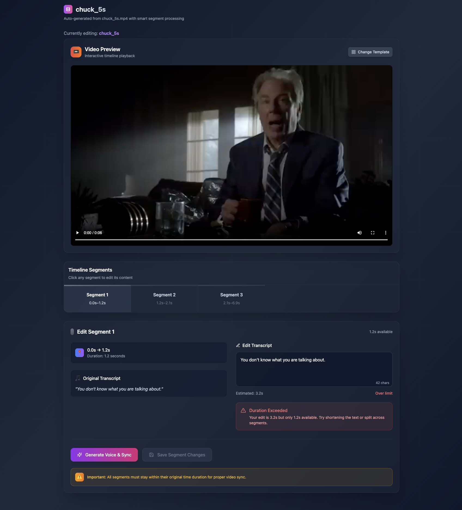

# LipSync Video Editor

A powerful video editing application with automated lip-syncing capabilities.

## Features

- 🎥 Video playback and editing interface
- 🎤 Automated lip-sync generation
- ✂️ Video segmentation and text editing
- 🎨 Modern, responsive UI

## Screenshot


*The main video editing interface*

## Getting Started

### Prerequisites
- Python 3.10.13
- Node.js (latest LTS version)
- npm or yarn

### Installation

1. Clone the repository:
   ```bash
   git clone https://github.com/your-username/lipsync.git
   cd lipsync
   ```

2. Set up the backend:
   ```bash
   cd backend
   python -m venv venv
   source venv/bin/activate  # On Windows: venv\Scripts\activate
   pip install -r requirements.txt
   ```

3. Set up the frontend:
   ```bash
   cd ../frontend
   npm install
   ```

### Running the Application

1. Start the backend server:
   ```bash
   cd backend
   uvicorn app.main:app --reload
   ```

2. In a new terminal, start the frontend:
   ```bash
   cd frontend
   npm run dev
   ```

3. Open your browser and navigate to `http://localhost:5173`

## License

This project is licensed under the MIT License. See the [LICENSE](LICENSE) file for details.
